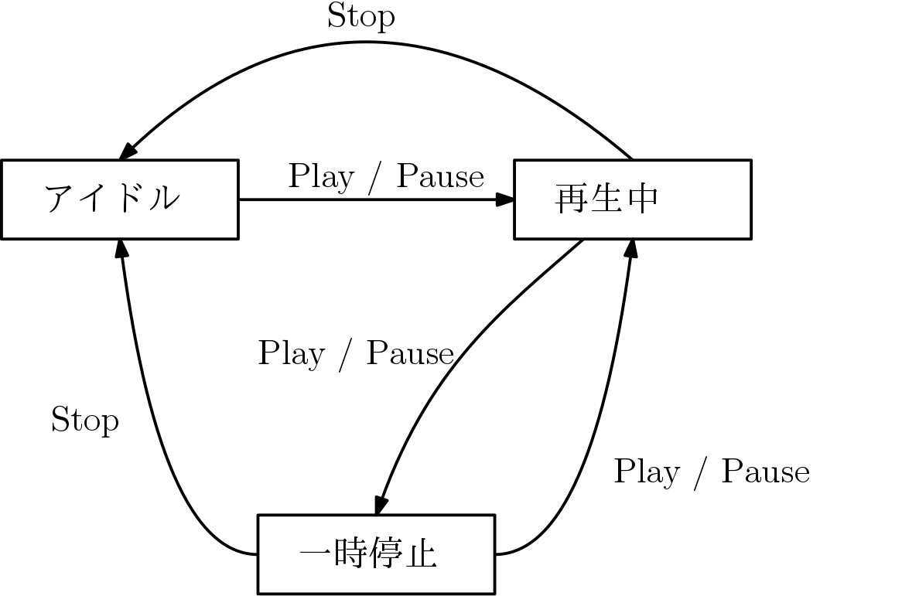

# C言語とデザインパターン

## Stateパターン

組み込み系で重宝するのが、このStateパターン。組み込み系ではハードウェアの状態に応じて動作をするプログラムを書く必要があるので、状態に応じて何らかの分岐処理を実現する必要がある。

ここでは簡単なCDプレーヤを考えてみる。

| ボタン          | 機能            |
|:---------------:|:---------------:|
| [Play or Pause] | 再生 / 一時停止 |
| [Stop]          | 停止            |

### 状態遷移図(cd1, cd2)

複数の状態と入力によってどのように遷移するのかを表したものとして状態遷移図がある。

この例では`playflag`と`pauseflag`で状態を保持しているが、このようにフラグを使いはじめると、プログラムを拡張するたびに際限なくフラグが増えていって、すぐに手が負えなくなる。そしていつの間にかモンスターメソッドになってしまう。

このコードの問題点は、まず３つ以上の状態をフラグで管理している点にある。 **フラグを使って良いのは２つの状態を管理する場合のみ** である。状態が３つ以上ある場合はフラグではなく列挙体を使わなければならない。

### 状態遷移表

