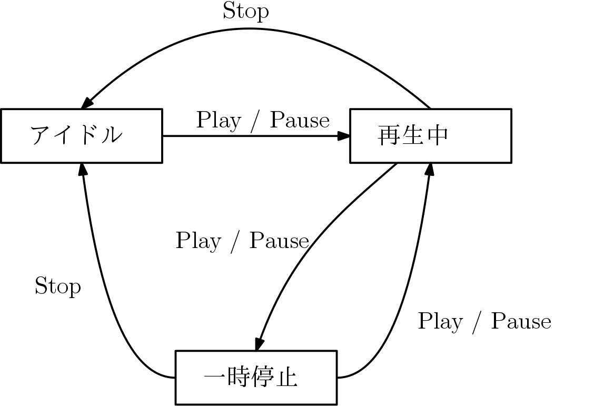

# C言語とデザインパターン

## Stateパターン

組み込み系で重宝するのが、このStateパターン。組み込み系ではハードウェアの状態に応じて動作をするプログラムを書く必要があるので、状態に応じて何らかの分岐処理を実現する必要がある。

ここでは簡単なCDプレーヤを考えてみる。

| ボタン          | 機能            |
|:---------------:|:---------------:|
| [Play or Pause] | 再生 / 一時停止 |
| [Stop]          | 停止            |

### 状態遷移図(cd1, cd2)

複数の状態と入力によってどのように遷移するのかを表したものとして状態遷移図がある。

この例では`playflag`と`pauseflag`で状態を保持しているが、このようにフラグを使いはじめると、プログラムを拡張するたびに際限なくフラグが増えていって、すぐに手が負えなくなる。そしていつの間にかモンスターメソッドになってしまう。

このコードの問題点は、まず３つ以上の状態をフラグで管理している点にある。 **フラグを使って良いのは２つの状態を管理する場合のみ** である。状態が３つ以上ある場合はフラグではなく列挙体を使わなければならない。

### 状態遷移表

状態と入力の組み合わせを網羅するには、状態遷移図より状態遷移表を書いたほうが良い。

| イベント / 状態                 | アイドル(ST\_IDLE) | 再生中(ST\_PLAY) | 一時停止中(ST\_PAUSE) |
|:-------------------------------:|:------------------:|:----------------:|:---------------------:|
| 停止(EV\_STOP)                  | 無視               | アイドルへ       | アイドルへ            |
| 再生 / 一時停止(EV\_PLAY_PAUSE) | 再生へ             | 一時停止へ       | 再生へ                |

### オブジェクト指向Stateパターン(cd3)

今の実装だと、onEvent()関数が`(状態数 x 入力数)`に応じて一気に肥大してしまう。そこでStateパターンを用いる。状態遷移図における各状態を「ノード」、EV\_STOP、EV\_PLAY\_PAUSEによる移動先を「エッジ」のようにして、各ノードをグローバルに実体化しておき、現在の状態(あるいはデフォルトの状態)のノードを指すポインタにより「現在の状態はどれか」を表す。

### 複数の状態セットが関係するケース(cd4)

実際の機器では複数の状態セットが関係しているケースがある。例えばCDがそもそも入っているかいないかなど。しかし先程のコードの中にCDが入っているかいないかみたいな条件分岐を入れるのは好ましくない。そういう場合は、さらに状態を付け加え直す。

| 合成状態     | 状態セット１ | 状態セット2 |
|:------------:|:------------:|:-----------:|
| アイドル(空) | アイドル     | CD空        |
| アイドル(有) | アイドル     | CD有        |
| NA           | 再生中       | CD空        |
| 再生中       | 再生中       | CD有        |
| NA           | 一時停止中   | CD空        |
| 一時停止中   | 一時停止中   | CD有        |

この場合における状態遷移表は下のようになる。

| イベント / 状態 | IDLE\_WITHOUT\_CD | IDLE\_WITH\_CD | PLAY        | PAUSE        |
|:---------------:|:-----------------:|:--------------:|:-----------:|--------------|
| stop            | ignore()          | ignore()       | stopPlay()  | stopPlay()   |
| PlayOrPause     | ignore()          | startPlay()    | pausePlay() | resumePlay() |
| disk            | insertCD()        | removeCD()     | removeCD()  | removeCD()   |

