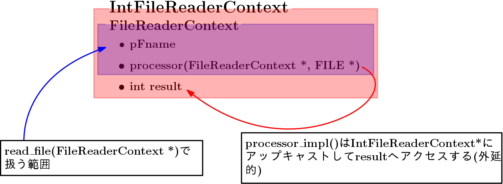

## テンプレートメソッドパターン

リソース(ファイル、メモリなど)は獲得したものを必ず開放しないといけないので管理がやっかい(fopen()->fclose(), malloc()->free())。例えば以下のような、指定されたファイルを読んで１行ごとに数字列を読み、その値の範囲を返すプログラム。

```cpp
int range(const char *pFname){
    FILE *fp = fopen(pFname, "r");
    if (fp == NULL) return -1;
    
    int min = INT_MAX;
    int max = INT_MIN;
    char buf[256];
    
    while(fgets(buf, sizeof(buf), fp) != NULL){
        int val = atoi(buf);
        min = (min > val)? val : min;
        max = (max < val)? val : max;
        }
        
    fclose(fp);
    
    return (max - min);
}
```

しかしもし「ファイルの中に空行が入っていたら-1を返す」という変更を行ったとしよう。ここで単純に

```cpp
while(fgets(buf, sizeof(buf), fp) != NULL){
if(buf[0] == '\n') return -1;
    }
```

としてしまうとfclose()できないのでリソースリークが起きる。こういう場合、breakやgotoを用いて抜けるといった方法も考えられる。C言語でgotoが用いられている場合、多くはリソースの解法が絡んでいる。

#### 前後に定形処理が必要なコード(template1)

リソースを扱うコードが複雑になるのは、リソースの管理コード(獲得と解放)がリソースを使うコードを挟んでいるため。このような場合にはテンプレートメソッドパターンが有効。プログラム中の一部の処理を関数(ポインタ)として差し替えられるようにすることでそれ以外の部分を定形処理として再利用できるようにする。

先ほどのプログラムで問題になっていた途中退室のケースも支障なく実装できる。リソースの管理は`read_file`関数に委ねられるので、`range_processor`をimplする人は、ファイルがNULLでないか否かを気にせず、openできている前提でロジックを書ける。このような設計パターンをloanパターンともいう。

### int以外を返す

さらに抽象化してint以外を返せるようにしたい。今は`read_file`において`processor`関数の結果を返しているが、int以外も返したいとなると、単純に実装すると`read_file`関数が型の数だけ増えてしまう。そこで継承を利用することで任意の型に対して利用できるようになる。

実装の型としては、インターフェス型では **機能だけ** を実装し、その関数(ポインタ)はそのインターフェス型へのthisポインタと、最低限の外から与える変数を引数に取るようにする。次にそのインターフェスを継承した自分用の構造体を作り、機能に必要なデータもメンバとして持たせる。そのときメンバ関数ポインタとしては(baseのメンバ関数ポインタ) **その構造体へアップキャストして** その構造体のデータを使うようにして実装した関数を登録すvる。

つまり、そのクラスを利用する関数(read\_file)側としてはインターフェース型のprocessorを呼び出しているが、実際はその効果は継承型へとextendするイメージ。



### 他のリソースを扱う

今まではファイルを扱ったが、実行時にバッファリングが必要になる場合はリソースとしてメモリを扱うことになる。つまりmallocとfreeの間に処理を挟むことになる。

次に複数のリソースを扱う場合を考える。例えばファイルに入ったデータをメモリに読み込んでからソートして、別のファイルに書き込むケースを考えてみる。この場合の手順は以下のようになる。

1. ファイルをオープン
2. fseek, ftellでサイズを知る
3. ファイルをクローズ
4. ファイル分のメモリを確保
5. ファイルをオープン
6. ファイルを読み込んでメモリにコピー
7. ファイルをクローズ
8. メモリをソート
9. ファイルをオープン
10. ファイルに書き込みクローズ
11. メモリを解放

まずファイルの読み込み、書き込みの部分は`FileAccessContext`というクラスに任せる。またメモリの管理は`BufferCotext`なるクラスに任せる。
`FileAccessContext`はメンバ変数としてファイル名とモード、ファイルに対する処理を表すメンバ関数`process`を持っている。`BufferContext`はバッファリングする領域とそのサイズ、バッファに対して行う処理を表すメンバ関数`process`を持っている。また`access_file(AccessFileContext *)`、`buffer(BufferContext *)`はその`process`をinvokeする関数(仮想関数呼び出し)である。

### コンテキスト

前回の実装ではファイルサイズの取得のために一旦ファイルをオープンしてから閉じ、再度読み込みのために開いており、必ずしも最適な動作ではない。ここを一回のオープンとクローズにまとめられないだろうか(一応補足するとfopenにおけるモードを"ab"に指定することで読み込みと書き込みを一回で行えるがここでは行わない)。

残念ながら今回の実装ではリソースの獲得と解放がコの字に入れ子になっているため実現できない。

buffer関数は関数ポインタで指定されたメンバ関数を呼び出す前にリソースを確保して、ユーザー関数の処理が終わったらリソースを確保する。このためbuffer関数はユーザー関数を呼び出す前にバッファのサイズを知っている必要がある。しかしこれではアプリケーションの設計に制約を課してしまう。

そこでコンテキスト(Context)なるバッファの動的確保、解放という動作を行う「場」を提供するものでワンクッションおく。

